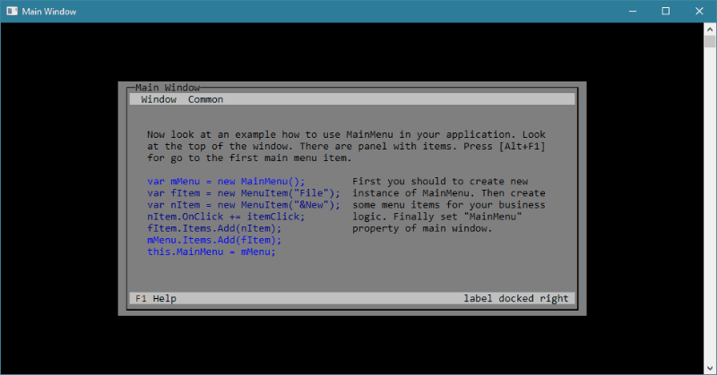
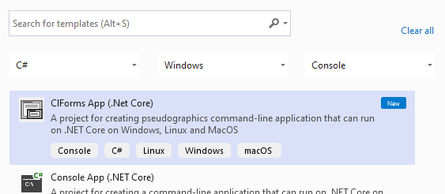
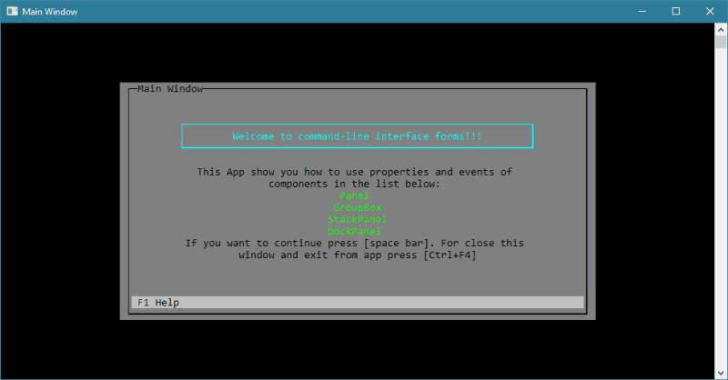

# clforms

**Pseudographics interface for console window by .Net Core 3.1**

## Installation:

Find the **ClForms** package through NuGet package manager inside Visual Studio or [here](https://www.nuget.org/packages/ClForms/)

> You can also download [ClFormsExtension](https://marketplace.visualstudio.com/items?itemName=KonoplevAnatolii.clforms) for creating pseudographics command-line application with this package
> 

## Documentation:
Go to the [Wiki page](https://github.com/Ahatornn/clforms/wiki) for mo information about **clforms**

## Controls
- [x] Button
- [x] Canvas
- [x] CheckBox
- [x] DockPanel
- [x] GlyphLabel
- [x] Grid
- [x] GroupBox
- [x] Label
- [x] ListBox
- [x] MessageBox
- [x] Panel
- [x] ProgressBar
- [x] RadioButton
- [x] StackPanel
- [x] StatusBar
- [x] StatusBarButton
- [x] TextBox
- [x] TilePanel
- [x] Window
- [ ] RadioGroup
- [ ] ListView

## Release Notes
* 1.0.23
    * Fix Window Measure with empty content
* 1.0.22
    * Fix invalidate visual elements when bg or fg are NotSet
    * Added BackgroundIsTransparent and ForegroundIsTransparent properties into Control
    * Fix Measure and Arrange of StackPanel
    * Fix Measure and Arrange of Window
* 1.0.21
    * Fix cursor position for focusing TextBox
* 1.0.20
    * Inject draw buffering
    * Refactoring ApplicationHandler
    * Refactoring IDrawingContext
* 1.0.19
    * FixPopupMenuContent autosize
    * Fix ListBoxBase methods
* 1.0.18
    * Added ProgressBar
    * Added TextBox
* 1.0.17
    * Added GlyphLabel
    * Implemented ListBox
* 1.0.16
    * Set DialogWindowBackground and DialogWindowForeground of HelpWindow
* 1.0.15
    * Fix Button render
    * Added DialogWindowBackground and DialogWindowForeground
    * Fix MessageBox size
* 1.0.14
    * Added MessageBox
* 1.0.13
    * Added GetRadioCheckChar in IEnvironment. 
    * Added PaintEventArgs
    * Added panels: Canvas, TilePanel
    * Added Buttons  

[More versions](https://www.nuget.org/packages/ClForms/)
