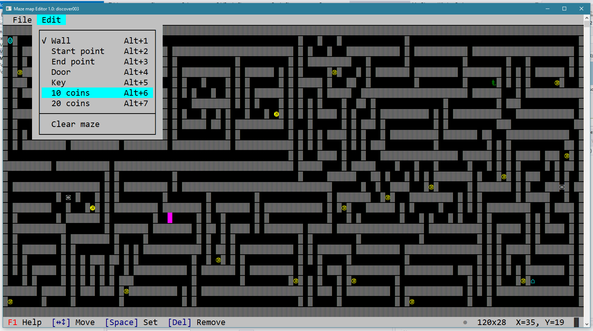
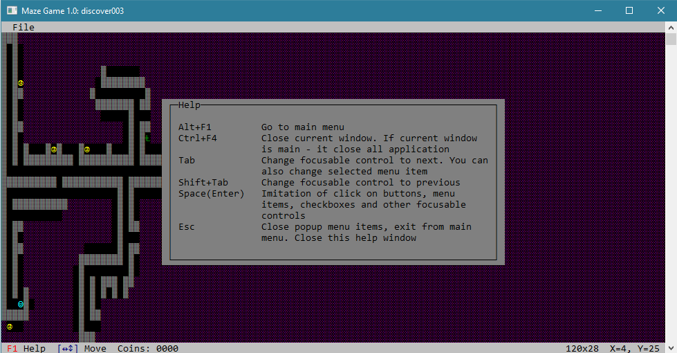

# clforms


[](https://www.nuget.org/packages/ClForms)
[](https://www.nuget.org/packages/ClForms)

**Pseudographics interface for console window by .Net Core 3.1**

**Attention!**
_After I finished making the project and was ready to put it on github, I was horrified to find that all the comments and summary in the code were written in Russian. I am currently rewriting comments file by file and will be adding them here soon_

Some examples about what I did by clforms:
<br/>
_Maze map editor_

<br/>
_Maze game_

<br/>
<br/>

Already have the components in the list below
-------------
- [x] Button
- [x] Canvas
- [x] CheckBox
- [x] DockPanel
- [x] GlyphLabel
- [x] Grid
- [x] GroupBox
- [x] Label
- [x] ListBox
- [x] MessageBox
- [x] Panel
- [x] ProgressBar
- [x] RadioButton
- [x] StackPanel
- [x] StatusBar
- [x] StatusBarButton
- [x] TextBox
- [x] TilePanel
- [x] Window

#### Planned date to release
------------
was: 30.04.2020
new: 12.05.2020 (making double buffer)


## Quick start
#### First
Prepare the `Startup` file. Its represents platform specific configuration that will be applied to a `IAppBuilder` when building an `IApp`. This class should be inherit from `IStartup` interface. Use `ConfigureServices` method for configure **IoC** of application. In runtime you can get specified instances like this:
```C#
using Microsoft.Extensions.DependencyInjection
.
.
var service = Application.ServiceProvider.GetService<instance_type>();
.
.
```
Also you can override core implementations of any types like `ISystemColors`, `IEventLoop`, `IPseudographicsProvider`, `IControlLifeCycle`, `IEnvironment` and `IApp`.
The `Configure` method allow set additional properties of added instances. For example, if you want to set `OutputEncoding` of `IPseudographicsProvider` but haven't own implemented, do like this:
```C#
provider.SetConfigure<IPseudographicsProvider>(configure =>
{
    configure.OutputEncoding = Encoding.GetEncoding("Utf-8");
});
```
Look at the `Startup` file example below
```C#
/// <inheritdoc cref="IStartup"/>
public class Startup : IStartup
{
    /// <inheritdoc cref="IStartup.ConfigureServices"/>
    public void ConfigureServices(IServiceCollection services)
    {
        // Optional
        // Called by the application to configure the app's services.
    }

    /// <inheritdoc cref="IStartup.Configure"/>
    public void Configure(IServiceProvider provider)
    {
        provider.SetConfigure<IPseudographicsProvider>(configure =>
        {
            configure.OutputEncoding = Encoding.GetEncoding("Utf-8");
        });
    }
}
```
#### Second
Prepare **MainWindow** class inherited from `Window` and implement your business logic using any exists or custom controls for making user interfaces

#### Third
Set your `Program` class like this:
```C#
internal class Program
{
    private static void Main(string[] args)
        => AppLoader.CreateDefaultBuilder(args)
            .UseStartup<Startup>()
            .Build()
            .Start(new MainWindow());
}
```
